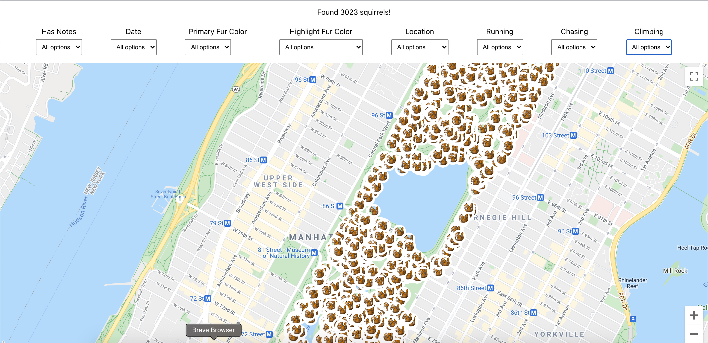
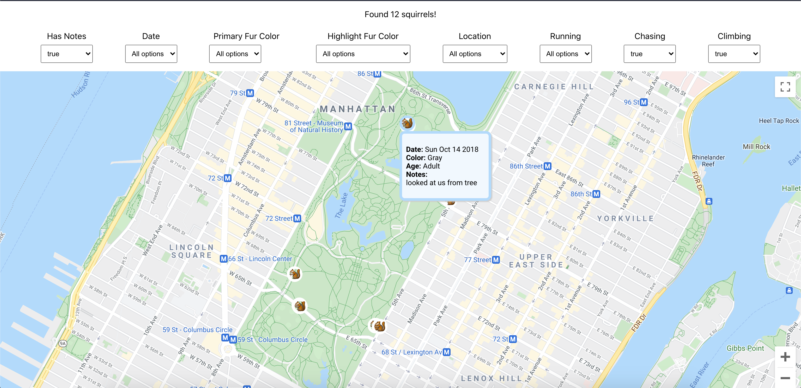
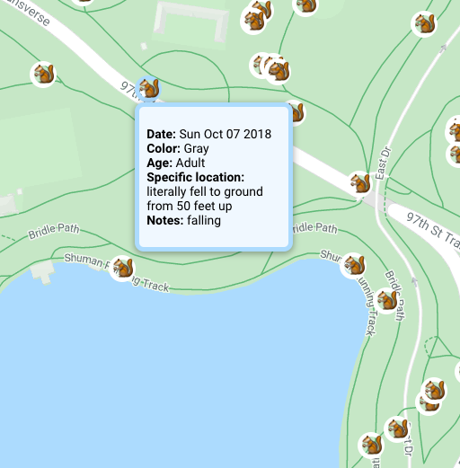
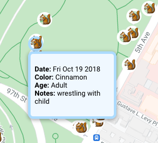

# NYC Squirrel Census Map

This app pulls data from [the 2018 Central Park Squirrel Census](https://data.cityofnewyork.us/Environment/2018-Central-Park-Squirrel-Census-Squirrel-Data/vfnx-vebw) and visualizes it on a map.

There are some filters that are dynamically generated from the API payload data which you can use to view certain types of squirrel encounters and behaviors.

I recommend turning the `Has Notes` filter to `true`. You'll find some charming stories of squirrel sightings from some very enthusiastic volunteers.

The map integration was built with the [google-map-react library](https://github.com/google-map-react/google-map-react) which made a lot of this very easy to do.

## Running locally
- Install yarn (alternative to npm) if you don't already have it: `npm install --global yarn`
- Install package.json dependencies: `yarn install`
- You will need the following API keys stored as envvars on your development machine:
    - `REACT_APP_NYC_DATA_APP_TOKEN`: app token for open data API
    - `REACT_APP_MAPS_API_KEY`: Google maps API key
- Start the application: `yarn start`

## Typescript conversion
The app is partially converted to Typescript, starting from the leaf components and moving up:
- `<InfoWindow />`
- `<Marker />`

Types shared by more than one component are in `/src/types/types.ts` for now.

The rest of the components, helper functions, and tests still need to be converted.

## TODOS

- [ ] Build a back end for better app token security
- [ ] Some other types of visualizations of insights from the data set
- [ ] Unit testing
